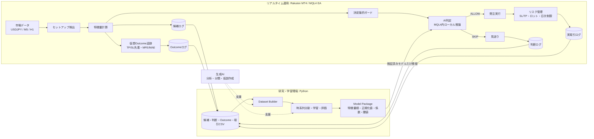
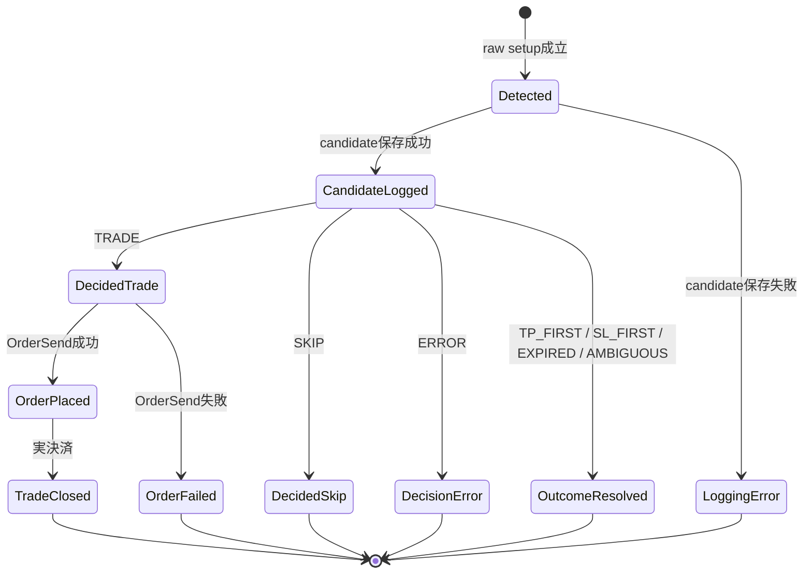

# MT4 × AI 学習データ蓄積システム仕様書

> ルールベースで候補シグナルを生成し、全候補の特徴量・判断・将来結果を蓄積する。Pythonで検証済みの機械学習モデルだけをMQL4へ移植し、取引可否のフィルターとして利用する。

| 項目 | 内容 |
|---|---|
| 対象 | Rakuten MetaTrader 4 / USDJPY / MQL4 EA / Python |
| 文書バージョン | 1.1 |
| 更新日 | 2026-07-25 |
| 推奨配置先 | `docs/ai-learning-data-spec.md` |
| 正本候補 | 本Markdown |

## 0. 要約

本システムの学習単位は**注文ではなく候補シグナル**とする。実際に発注した候補だけでなく、スプレッド、日次制限、既存ポジション、AI判定などで見送った候補にも仮想TP/SL結果を付ける。

```text
ルール戦略が候補を検出
        ↓
候補時点の特徴量を保存
        ↓
安全フィルター・AI判定を保存
        ↓
発注または見送り
        ↓
全候補の仮想結果と実取引結果を保存
        ↓
Pythonで時系列検証
        ↓
合格モデルだけMQL4へ移植
```

導入は次の順序を厳守する。

1. **Logging**: 全候補・判断・実取引を保存する。
2. **Outcome**: 全候補へTP/SL先着、MFE/MAE、期限切れを付与する。
3. **Analysis**: 時間帯・方向・ボラティリティなどの分布を分析する。
4. **Shadow AI**: AIは予測するが、注文には影響させない。
5. **Gate AI**: 未使用期間とフォワードで合格したモデルだけ取引可否へ使用する。

> AIはロット、SL/TP、日次損失制限、連敗制限を変更できない。AIの役割は、決定論的に安全な候補をさらに`ALLOW`または`SKIP`へ分類することだけである。

## 1. 背景と目的

### 1.1 背景

同一期間のバックテストでは、入口ロジックをEMAクロスから押し目・戻りへ変更しても、期待値は改善しなかった。

| 戦略 | 取引数 | PF | 勝率 | 評価 |
|---|---:|---:|---:|---|
| EMAクロス系 | 251 | 0.75 | 33.47% | RR約1.5に必要な勝率へ未達 |
| 緩和した押し目・戻り系 | 1,102 | 0.76 | 33.94% | 発生頻度だけ増え、品質は改善せず |

同じインジケーター群の閾値調整を続けるより、候補が成功・失敗した市場環境を再現可能なデータとして保存し、統計分析と機械学習で選別可能か検証する基盤が必要である。

### 1.2 目的

- ルール上成立した候補シグナルを発注有無にかかわらず保存する。
- 候補時点で利用可能な特徴量だけを保存する。
- 候補、判断、仮想結果、実取引を`signal_id`で関連付ける。
- バックテスト、フォワード、ライブで同じデータ契約を使用する。
- PythonとMQL4の推論結果を一致させる。
- 未使用期間で改善を確認できないモデルは実運用へ投入しない。

## 2. 対象範囲

### 2.1 対象

- MQL4での候補検出、特徴量計算、CSV出力。
- セッション、スプレッド、ATR、保有ポジション、クールダウン、日次制限などの判断履歴。
- 全候補に対する仮想TP/SL先着、MFE/MAE、経過時間の追跡。
- 実取引の発注、約定、決済、損益、保有時間の記録。
- Pythonによる検証、結合、学習、評価、MQL4モデル出力。
- MQL4内ローカル推論による`OFF`、`SHADOW`、`GATE`運用。

### 2.2 対象外

- 生成AIが売買方向、ロット、SL/TPを自由生成する方式。
- 外部LLM APIや`WebRequest()`を必須とするリアルタイム発注。
- DLLや外部プロセスを必須とする初期構成。
- AIによるSL拡大、リスク上限解除、ナンピン、マーチンゲール。
- ランダム分割だけで性能を評価する学習。
- ニュース本文、認証情報、個人情報の保存。
- EA自身による自動再学習・自動モデル更新。

## 3. 設計原則

| ID | 原則 | 仕様 |
|---|---|---|
| P-01 | 候補先行 | ルール戦略が候補を生成し、AIは候補を許可または拒否する。 |
| P-02 | 全候補記録 | raw setup成立後、安全フィルターより前に候補を保存する。 |
| P-03 | 未来情報禁止 | 特徴量は候補時点で確定済みの値だけを使用する。 |
| P-04 | リスク分離 | ロット、SL/TP、損失上限はMQL4の決定論的処理を正本とする。 |
| P-05 | Append-only | candidate、decision、outcome、tradeは追記イベントとして保存し、既存行を更新しない。 |
| P-06 | 再現性 | EA版、戦略版、特徴量版、モデル版、入力値、期間を記録する。 |
| P-07 | Fail-closed | `GATE`でモデル・特徴量・ログに重大な異常があれば新規発注を停止する。 |
| P-08 | 段階導入 | Logging → Outcome → Analysis → Shadow → Gateの順序を崩さない。 |
| P-09 | 未使用期間優先 | TrainやValidationの利益ではなく、TestとForwardを採用判断の中心にする。 |
| P-10 | モデル固定 | ライブ中にモデル係数、正規化値、閾値を自動変更しない。 |

## 4. システム構成



### 4.1 コンポーネント

| 区分 | コンポーネント | 責務 |
|---|---|---|
| MQL4 | Setup Detector | 確定足でルール戦略のraw setupを検出する。 |
| MQL4 | Feature Calculator | 候補時点の特徴量を固定順序で計算する。 |
| MQL4 | Deterministic Guard | スプレッド、損失上限、保有状態などを判定する。 |
| MQL4 | Model Runtime | 埋め込みモデルで成功確率を計算する。 |
| MQL4 | Decision Engine | `TRADE`、`SKIP`、`ERROR`を決定する。 |
| MQL4 | Outcome Tracker | 全候補の仮想TP/SL、MFE/MAE、期限を追跡する。 |
| MQL4 | Trade Logger | 実際の注文と決済結果を保存する。 |
| Python | Dataset Builder | CSVを検証し、1行1候補の学習データへ結合する。 |
| Python | Trainer / Evaluator | 時系列分割、確率校正、未使用期間評価を行う。 |
| Python | MQL4 Exporter | 係数、正規化値、特徴量順、閾値をMQL4へ出力する。 |
| 生成AI | Research Assistant | レポート要約、失敗パターン整理、仮説作成を支援する。 |

## 5. ドメインモデルとライフサイクル

### 5.1 エンティティ

| エンティティ | 粒度 | 説明 |
|---|---|---|
| RunManifest | 1実行1行 | バックテスト・フォワード・ライブ実行の設定を固定する。 |
| SignalCandidate | 1候補1行 | raw setup成立時点の特徴量と仮想価格を保存する。 |
| SignalDecision | 1候補1行 | 安全判定、AIスコア、最終判断、理由を保存する。 |
| SignalOutcome | 1候補1行 | TP/SL先着、期限切れ、MFE/MAEを保存する。 |
| TradeResult | 1注文1行 | 実際に発注された取引の約定・決済結果を保存する。 |
| RuntimeError | 1障害1行 | ログ、モデル、発注などの異常を保存する。 |
| ModelPackage | 1モデル1式 | 特徴量順、正規化値、係数、閾値、版を固定する。 |

### 5.2 状態遷移



`SignalOutcome`は実発注とは独立して追跡する。`SKIP`された候補にも結果を付けることで、AIが「何を避けるべきか」を学習できる。

### 5.3 処理順序

1. 新しい確定足を検出する。
2. raw setupを評価する。
3. setup成立時に特徴量、仮想Entry/SL/TP、`signal_id`を確定する。
4. `SignalCandidate`を保存する。
5. Outcome Trackerへ候補を登録する。
6. 決定論的ガードを順番に評価する。
7. eligibleな候補だけAI推論する。
8. `SignalDecision`を保存する。
9. `TRADE`の場合だけ発注する。
10. 発注成功後、ticketとの対応を保存する。
11. Outcome Trackerが仮想結果を確定する。
12. 実決済時に`TradeResult`を保存する。

> `Candidate`の保存に失敗した候補は、`GATE`では発注しない。学習データと実取引の対応が失われるためである。

## 6. 機能要件

### 6.1 ログ・追跡

| ID | 要件 | 仕様 |
|---|---|---|
| FR-001 | 候補記録 | raw setup成立ごとに一意な`signal_id`を生成する。 |
| FR-002 | 全候補追跡 | 発注・見送りにかかわらずOutcome Trackerへ登録する。 |
| FR-003 | 判断記録 | deterministic結果、AI結果、最終判断、理由コードを保存する。 |
| FR-004 | 実取引関連付け | 発注成功時に`signal_id`とticketを関連付ける。 |
| FR-005 | 決済記録 | 純損益、R損益、保有時間、決済理由を保存する。 |
| FR-006 | 実行識別 | 全イベントへ`run_id`を付与する。 |
| FR-007 | 版管理 | EA、戦略、特徴量、ラベル、モデルの各版を保存する。 |
| FR-008 | 重複防止 | 同一`run_id + signal_id + event_type`を二重出力しない。 |
| FR-009 | 再起動復旧 | 未確定候補を再構築し、outcomeの二重出力を防ぐ。 |
| FR-010 | エラー記録 | ファイルI/O、モデル、特徴量、注文エラーを保存する。 |

### 6.2 AIモード

| ID | 要件 | 仕様 |
|---|---|---|
| FR-011 | OFF | AI計算を行わず、ルール版として動作する。 |
| FR-012 | SHADOW | AIスコアを保存するが、注文可否には影響させない。 |
| FR-013 | GATE | deterministic eligibleかつ確率閾値以上だけ発注する。 |
| FR-014 | 互換性 | AI OFF時はAI追加前の注文列と一致する。 |
| FR-015 | モデル整合 | schema、特徴量数、順序、正規化値、モデル版を検証する。 |

## 7. データ契約

### 7.1 保存先

初期版はMT4端末固有のファイル領域を使用する。Strategy Testerでは`Tester\Files`へ分離される。複数端末の混在を避けるため、初期版で`FILE_COMMON`は使用しない。

```text
AIData/
  run_manifest_<run_id>.csv
  signal_candidates_<run_id>.csv
  signal_decisions_<run_id>.csv
  signal_outcomes_<run_id>.csv
  trade_results_<run_id>.csv
  runtime_errors_<run_id>.csv
  pending_outcomes_<run_id>.csv   # 復旧用スナップショット
```

イベントログはappend-onlyとする。`pending_outcomes`だけは復旧用スナップショットであり、原子的な一時ファイル置換を許可する。

### 7.2 共通規約

- 文字コード: ASCII互換の英数字コードを基本とする。
- 日時: `yyyy-MM-dd HH:mm:ss`とUnix秒を併記する。
- 小数: `.`固定。桁数はフィールドごとに固定する。
- bool: `0`または`1`。
- enum: 英大文字の固定コード。
- 欠損: 空文字。`0`を欠損値として使用しない。
- ヘッダー: 新規ファイル作成時だけ1回出力する。
- CSV内の自由文は禁止し、理由は固定コードで保存する。

### 7.3 識別子

| 項目 | 形式例 | 仕様 |
|---|---|---|
| `run_id` | `BT_20250701_20260722_M5_5PT_a1b2c3d4` | 種別、期間、時間足、スプレッド、パラメータ短縮ハッシュを含む。 |
| `signal_id` | `run_id\|USDJPY\|B\|1751393700\|001` | run、symbol、方向、候補時刻、連番を連結する。 |
| `signal_key` | `B1751393700001` | 注文コメント・ticket対応用の短縮キー。 |
| `model_version` | `logreg_20260725_001` | 学習手法、日付、連番。 |
| `parameter_hash` | `a1b2c3d4` | 入力値の正規化文字列をCRC32またはFNV-1aで算出する。 |

MT4の注文コメントへ長い`signal_id`を直接格納しない。コメントには短い`signal_key`だけを保存し、`signal_id ↔ signal_key ↔ ticket`をdecisionログで関連付ける。

### 7.4 バージョン項目

| 項目 | 例 | 更新条件 |
|---|---|---|
| `ea_version` | Git SHA | EAコード変更時 |
| `strategy_version` | `tokyo_eu_breakout_v1` | setup条件変更時 |
| `feature_schema_version` | `1.0.0` | 特徴量の追加・削除・意味変更時 |
| `label_version` | `tp15_sl10_h48_v1` | TP/SL倍率、期間、判定方法変更時 |
| `model_version` | `logreg_20260725_001` | 再学習・係数変更時 |

### 7.5 RunManifest

`run_manifest`は実行開始時に1行だけ書く不変データとする。終了時刻は最終イベント時刻から導出し、既存行を更新しない。

| フィールド | 型 | 必須 | 説明 |
|---|---|---:|---|
| run_id | string | ✓ | 実行ID |
| data_source | enum | ✓ | `BACKTEST` / `FORWARD` / `LIVE` |
| start_time | datetime | ✓ | 実行開始時刻 |
| symbol | string | ✓ | 通貨ペア |
| signal_timeframe | int | ✓ | M5は5 |
| ea_version | string | ✓ | EA版 |
| strategy_version | string | ✓ | 戦略版 |
| feature_schema_version | string | ✓ | 特徴量版 |
| label_version | string | ✓ | ラベル版 |
| parameter_hash | string | ✓ | 入力値ハッシュ |
| spread_mode | string | ✓ | `CURRENT` / `FIXED_5`等 |
| initial_deposit | double | BTのみ | 初期証拠金 |
| terminal_build | int | ✓ | MT4 build |
| broker_server | string | ✓ | サーバー識別子 |

### 7.6 SignalCandidate

| フィールド | 型 | 分類 | 説明 |
|---|---|---|---|
| run_id | string | 識別 | 実行ID |
| signal_id | string | 識別 | 候補ID |
| signal_key | string | 識別 | 短縮キー |
| signal_time | datetime | 識別 | 候補確定時刻 |
| signal_epoch | long | 識別 | Unix秒 |
| symbol | string | 識別 | 通貨ペア |
| direction | enum | 識別 | `BUY` / `SELL` |
| setup_type | string | 識別 | 戦略セットアップ種別 |
| strategy_version | string | 版 | 戦略版 |
| feature_schema_version | string | 版 | 特徴量版 |
| label_version | string | 版 | ラベル版 |
| server_hour | int | 特徴量 | 0〜23 |
| weekday | int | 特徴量 | 0〜6 |
| session_tag | enum | 特徴量 | `TOKYO` / `EUROPE` / `NY` / `OVERLAP` / `OTHER` |
| bid | double | 価格 | 判定時Bid |
| ask | double | 価格 | 判定時Ask |
| spread_pips | double | 特徴量 | スプレッド |
| virtual_entry_price | double | ラベル基準 | 買いAsk、売りBid |
| virtual_sl_price | double | ラベル基準 | 仮想SL |
| virtual_tp_price | double | ラベル基準 | 仮想TP |
| risk_pips | double | 特徴量 | EntryからSLまで |
| reward_pips | double | 特徴量 | EntryからTPまで |
| atr_pips | double | 特徴量 | ATR |
| atr_change | double | 特徴量 | 直前値との差または比率 |
| rsi | double | 特徴量 | RSI |
| adx | double | 特徴量 | ADX |
| h1_trend | int | 特徴量 | `-1 / 0 / 1` |
| range_width_pips | double | 特徴量 | 基準レンジ幅 |
| breakout_strength | double | 特徴量 | ブレイク幅のATR正規化値 |
| body_pips | double | 特徴量 | シグナル足実体 |
| upper_wick_pips | double | 特徴量 | 上ヒゲ |
| lower_wick_pips | double | 特徴量 | 下ヒゲ |
| tick_volume | long | 特徴量 | MT4 tick volume |

`data_source`、実損益、将来MFE/MAE、最終日次損益は学習特徴量へ含めない。

### 7.7 SignalDecision

| フィールド | 型 | 説明 |
|---|---|---|
| run_id | string | 実行ID |
| signal_id | string | 候補ID |
| signal_key | string | 短縮キー |
| decision_time | datetime | 判断時刻 |
| deterministic_eligible | bool | 全安全条件を通過したか |
| failed_stage | string | 最初に失敗した判定段階 |
| reason_code | string | 固定理由コード |
| ai_mode | enum | `OFF` / `SHADOW` / `GATE` |
| ai_probability | double/null | 成功確率 |
| ai_threshold | double/null | Gate閾値 |
| model_version | string/null | モデル版 |
| final_decision | enum | `TRADE` / `SKIP` / `ERROR` |
| ticket | long/null | 発注成功時ticket |
| order_error | int/null | OrderSend失敗コード |

### 7.8 SignalOutcome

| フィールド | 型 | 説明 |
|---|---|---|
| run_id | string | 実行ID |
| signal_id | string | 候補ID |
| outcome_time | datetime | 結果確定時刻 |
| outcome | enum | `TP_FIRST` / `SL_FIRST` / `EXPIRED` / `AMBIGUOUS` |
| label_tp_before_sl | int/null | 成功1、失敗0、未確定は空 |
| bars_to_outcome | int | 経過バー数 |
| seconds_to_outcome | long | 経過秒 |
| mfe_pips | double | 最大順行幅 |
| mae_pips | double | 最大逆行幅 |
| mfe_r | double | MFE / risk_pips |
| mae_r | double | MAE / risk_pips |
| outcome_tracker_version | string | 追跡実装版 |

### 7.9 TradeResult

| フィールド | 型 | 説明 |
|---|---|---|
| run_id | string | 実行ID |
| signal_id | string | 候補ID |
| signal_key | string | 短縮キー |
| ticket | long | MT4 ticket |
| direction | enum | `BUY` / `SELL` |
| entry_time | datetime | 約定時刻 |
| exit_time | datetime | 決済時刻 |
| lots | double | ロット |
| entry_price | double | 約定価格 |
| exit_price | double | 決済価格 |
| initial_sl | double | 初期SL |
| initial_tp | double | 初期TP |
| profit | double | OrderProfit |
| commission | double | 手数料 |
| swap | double | スワップ |
| net_profit | double | 純損益 |
| initial_risk_money | double | 初期リスク金額 |
| realized_r | double | 純損益 / 初期リスク金額 |
| exit_reason | enum | `TP` / `SL` / `BE` / `TRAIL` / `MANUAL` / `OTHER` |
| holding_seconds | long | 保有秒 |
| mfe_pips | double | 実取引中MFE |
| mae_pips | double | 実取引中MAE |

## 8. 学習ラベル

### 8.1 主ラベル

主ラベルは「-1Rへ到達する前に+1.5Rへ到達したか」とする。Rは候補時点の仮想Entryと仮想SLの距離で固定し、実発注の有無や後続のトレーリングに依存させない。

| outcome | label | 条件 |
|---|---:|---|
| TP_FIRST | 1 | 有効期限内にSLより先にTPへ到達 |
| SL_FIRST | 0 | 有効期限内にTPより先にSLへ到達 |
| EXPIRED | null | 期限内にどちらにも到達しない |
| AMBIGUOUS | null | 先着順を確定できない |

### 8.2 Bid / Ask判定

- BUY: TPは`Bid >= virtual_tp_price`、SLは`Bid <= virtual_sl_price`。
- SELL: TPは`Ask <= virtual_tp_price`、SLは`Ask >= virtual_sl_price`。
- 仮想Entryは候補確定後の最初の発注可能tickで、BUYはAsk、SELLはBidを使用する。
- 全ティックではtick順序で判定する。
- OHLCモデルで同一バー内にTP/SL両方が入る場合は`AMBIGUOUS`とする。
- 既定期限は`LabelMaxBars=48`（M5で4時間）とする。

### 8.3 MFE / MAE

- BUY MFE: 追跡中の最大Bid − virtual entry。
- BUY MAE: virtual entry − 追跡中の最小Bid。
- SELL MFE: virtual entry − 追跡中の最小Ask。
- SELL MAE: 追跡中の最大Ask − virtual entry。
- すべてpipsとRの両方で保存する。

### 8.4 重複候補と学習リーク

候補の追跡期間が重なる場合、隣接シグナルのラベルは独立ではない。Python側では次を実施する。

- ランダム分割を禁止する。
- 時系列分割境界を跨ぐ候補をpurgeする。
- Validation/Test開始前に少なくとも`LabelMaxBars`相当のembargoを設ける。
- 同一相場イベントから大量発生した候補へ必要に応じて重みを付ける。
- 指標は候補数だけでなく、日別・週別・月別でも集計する。

## 9. MQL4実装仕様

### 9.1 推奨モジュール

```text
src/MQL4/Experts/USDJPY_Scalp_MA_RSI.mq4
src/MQL4/Include/AIData/Types.mqh
src/MQL4/Include/AIData/RunContext.mqh
src/MQL4/Include/AIData/FeatureBuilder.mqh
src/MQL4/Include/AIData/CsvWriter.mqh
src/MQL4/Include/AIData/SignalLogger.mqh
src/MQL4/Include/AIData/OutcomeTracker.mqh
src/MQL4/Include/AIData/TradeResultLogger.mqh
src/MQL4/Include/AIData/ModelRuntime.mqh
```

EA本体は売買オーケストレーションに限定し、CSV列順、特徴量計算、Outcome追跡、モデル推論を分離する。

### 9.2 追加input

| input | 型 | 既定 | 説明 |
|---|---|---:|---|
| `EnableDatasetLogging` | bool | true | 学習ログ有効化 |
| `LabelMaxBars` | int | 48 | 仮想結果追跡期限 |
| `AI_Mode` | enum | OFF | `OFF / SHADOW / GATE` |
| `AI_MinProbability` | double | 0.60 | Gate閾値。学習後に確定 |
| `AI_ErrorPolicy` | enum | FAIL_CLOSED_GATE | Gate異常時の停止方針 |
| `FeatureSchemaVersion` | string | `1.0.0` | 特徴量版 |
| `LabelVersion` | string | `tp15_sl10_h48_v1` | ラベル版 |
| `StrategyVersion` | string | `tokyo_eu_breakout_v1` | 戦略版 |
| `ModelVersion` | string | 空 | 埋め込みモデル版 |
| `LogFlushEveryN` | int | 1 live / 50 test | flush頻度 |

`ELIGIBLE_ONLY`のログモードは設けない。全候補が保存されないと選択バイアスが生じるためである。

### 9.3 修正前

```mql4
if(buy && PlaceOrder(OP_BUY, slPips, tpPips))
   Print("BUY placed");
else if(sell && PlaceOrder(OP_SELL, slPips, tpPips))
   Print("SELL placed");
```

この構造では、発注されなかった候補、候補時点の特徴量、見送り理由が残らない。

### 9.4 修正後

```mql4
void ProcessSetup(const int direction,
                  const datetime signalBarTime,
                  const double slPips,
                  const double tpPips)
{
   SignalFeatures features;
   if(!BuildSignalFeatures(direction, signalBarTime, slPips, tpPips, features))
   {
      LogRuntimeError("FEATURE_BUILD_FAILED", GetLastError());
      return;
   }

   string signalId  = CreateSignalId(direction, signalBarTime);
   string signalKey = CreateCompactSignalKey(direction, signalBarTime);

   if(!LogSignalCandidate(signalId, signalKey, features))
   {
      LogRuntimeError("CANDIDATE_LOG_FAILED", GetLastError());
      if(AI_Mode == AI_GATE) return;
   }

   RegisterPendingOutcome(signalId, features);

   DecisionResult decision;
   EvaluateDeterministicGuards(features, decision);

   double probability = EMPTY_VALUE;
   if(decision.eligible && AI_Mode != AI_OFF)
   {
      probability = PredictTradeProbability(features);
      if(!MathIsValidNumber(probability))
      {
         decision.allow = false;
         decision.reasonCode = "FEATURE_INVALID";
      }
      else if(AI_Mode == AI_GATE && probability < AI_MinProbability)
      {
         decision.allow = false;
         decision.reasonCode = "AI_REJECTED";
      }
   }

   int ticket = -1;
   if(decision.allow)
      ticket = PlaceOrderWithSignalKey(direction, slPips, tpPips, signalKey);

   LogSignalDecision(signalId, signalKey, decision, probability, ticket);
}
```

### 9.5 CSV書込

- `FILE_CSV | FILE_READ | FILE_WRITE | FILE_SHARE_READ | FILE_ANSI`を使用する。
- `FileSeek(handle, 0, SEEK_END)`で追記する。
- ファイルサイズ0の場合だけヘッダーを書く。
- 列順は`FeatureSchema.mqh`の定義を正本とする。
- 1行書込後の`FileFlush()`頻度はinputで制御する。
- エラー時はファイル名、イベント種別、`GetLastError()`を記録する。
- Gateでcandidateまたはdecisionログが保存できない場合は発注を停止する。

### 9.6 Outcome Tracker

- 最大pending件数をinputまたは定数で管理する。
- OnTickでBid/Ask、TP/SL、MFE/MAEを更新する。
- 確定時にoutcomeを1回だけappendし、pendingから削除する。
- pending状態は一定間隔で一時ファイルへ保存後、正式ファイルへ置換する。
- 起動時にcandidate、outcome、pending snapshotを照合して未確定候補を復元する。
- Strategy Tester開始時は別`run_id`のpendingを読み込まない。

### 9.7 実取引との関連付け

注文コメントには`signal_key`を格納する。

```mql4
string comment = "AI|" + signalKey + "|R=" + DoubleToString(actualStop, 2);
```

コメントがブローカー側で変更・短縮される可能性があるため、ticket取得直後にdecisionログへ`signal_id`、`signal_key`、ticketを保存する。このログを正本とし、注文コメントだけに依存しない。

## 10. Python学習パイプライン

### 10.1 ディレクトリ

```text
python/ai_pipeline/
  schemas.py
  validate_logs.py
  build_dataset.py
  feature_engineering.py
  split_timeseries.py
  train_baseline.py
  calibrate_probability.py
  evaluate_oos.py
  export_mql4_model.py
  parity_check.py
  models/<model_version>/
    model.pkl
    metrics.json
    feature_list.json
    scaler.json
    threshold.json
    model_manifest.json
    mql4_model.mqh
  reports/
```

### 10.2 データ検証

1. manifestと各CSVのschemaを検証する。
2. `run_id`、`signal_id`の重複を検出する。
3. candidate、decision、outcome、tradeをleft joinする。
4. 時刻逆転、価格矛盾、TP/SL方向矛盾を検出する。
5. future列がfeature listへ入っていないことを検査する。
6. バージョン混在を拒否または明示的に分割する。
7. `EXPIRED`、`AMBIGUOUS`の扱いを固定する。
8. 最終データを1行1`signal_id`へ整形する。

### 10.3 時系列分割

| 区分 | 用途 | 目安 |
|---|---|---|
| Train | 係数学習 | 最古60% |
| Validation | モデル選択、校正、閾値決定 | 次の20% |
| Test | 完全未使用期間の最終評価 | 最新20% |
| Forward | Test後に新規蓄積したデータ | Shadow運用 |

分割は日付境界で行い、追跡期間が境界を跨ぐ行をpurgeし、境界後にembargoを置く。

### 10.4 初期モデル

初期モデルはロジスティック回帰を必須ベースラインとする。

- MQL4へ係数を直接移植できる。
- 正規化と特徴量順を固定しやすい。
- 予測理由を確認しやすい。
- 小規模データで複雑なモデルより過学習を抑えやすい。

比較候補は深さを制限した決定木または勾配ブースティングとする。ニューラルネットワークは初期対象外とする。

### 10.5 モデルパッケージ

`ModelPackage`には次を必須とする。

```json
{
  "model_version": "logreg_20260725_001",
  "feature_schema_version": "1.0.0",
  "label_version": "tp15_sl10_h48_v1",
  "feature_names": ["server_hour", "spread_pips", "atr_pips"],
  "means": [14.0, 0.5, 4.2],
  "scales": [3.2, 0.1, 1.4],
  "intercept": -0.42,
  "coefficients": [0.04, -0.31, 0.18],
  "gate_threshold": 0.61
}
```

特徴量名、順序、mean、scale、係数、切片、閾値のいずれかが不一致ならGateを停止する。

### 10.6 MQL4内推論

```mql4
double z = MODEL_INTERCEPT;
for(int i=0; i<MODEL_FEATURE_COUNT; i++)
{
   double normalized = (features[i] - MODEL_MEAN[i]) / MODEL_SCALE[i];
   z += MODEL_COEF[i] * normalized;
}

double probability = 1.0 / (1.0 + MathExp(-z));
```

Python側とMQL4側で同じ丸め・欠損処理を使用する。

### 10.7 評価指標

**分類指標**

- ROC-AUC、PR-AUC
- LogLoss、Brier Score
- Calibration curve

**トレード指標**

- PF、期待値、勝率、最大DD
- 採用取引数、採用率
- 月別、方向別、セッション別
- ルール全候補とAI採用候補の差
- AIが棄却した候補の実績

**安定性**

- 閾値±0.05
- スプレッド悪化
- 年別、月別、曜日別
- BUY / SELL別
- 特定月・特定数件への利益集中

## 11. AI判定と安全性

### 11.1 モード

| モード | AI計算 | 注文への影響 | 用途 |
|---|---|---|---|
| OFF | なし | なし | ルール版ベースライン |
| SHADOW | あり | なし | 予測蓄積、推論一致、ドリフト確認 |
| GATE | あり | 閾値未満をSKIP | 合格モデルのみ |

### 11.2 最終許可条件

```mql4
finalAllow = setupDetected
          && candidateLogged
          && deterministicEligible
          && (AI_Mode != AI_GATE || aiProbability >= AI_MinProbability);
```

AI確率が高くても、スプレッド、ロット、日次損失、連敗、保有ポジションなどの安全条件を迂回できない。

### 11.3 エラー方針

| 状況 | OFF / SHADOW | GATE |
|---|---|---|
| モデル未読込 | ルール運用継続、警告 | 新規発注停止 |
| schema不一致 | スコア無効、警告 | 新規発注停止 |
| NaN / 無限値 | スコア無効 | 候補SKIP |
| candidateログ失敗 | 警告 | 新規発注停止 |
| decisionログ失敗 | 警告 | 新規発注停止 |
| outcomeログ失敗 | 警告、復旧対象 | 新規候補受付停止を推奨 |
| OrderSend失敗 | エラー記録 | エラー記録 |

## 12. 非機能要件

| ID | 分類 | 要件 |
|---|---|---|
| NFR-001 | 再現性 | 同じ候補でPythonとMQL4の予測差を`1e-6`以内にする。 |
| NFR-002 | 性能 | 通常tickの追加処理を平均1ms未満の目標とする。 |
| NFR-003 | 耐障害性 | イベントログはappend-only、pendingは復旧可能にする。 |
| NFR-004 | 互換性 | AI OFFで既存注文列が変わらない。 |
| NFR-005 | 可観測性 | run、signal、reason、model、ticketから判断経路を追跡できる。 |
| NFR-006 | データ品質 | 必須欠損率0.5%未満、ID重複0件。 |
| NFR-007 | セキュリティ | 外部通信・DLLなし。秘密情報・個人情報を保存しない。 |
| NFR-008 | 保守性 | schema変更時は版を更新し、旧モデルとの混用を拒否する。 |
| NFR-009 | 移植性 | MT4 build差異をmanifestへ記録する。 |
| NFR-010 | 監査性 | 採用モデルの学習期間、コード版、閾値を保存する。 |

## 13. テスト仕様

### 13.1 MQL4単体・結合

| ID | テスト | 合格条件 |
|---|---|---|
| TC-001 | コンパイル | MetaEditorでエラー0・警告0。 |
| TC-002 | ヘッダー | 各CSVにヘッダーが1回だけ出力される。 |
| TC-003 | 候補一意性 | 同一確定足・同方向の重複候補がない。 |
| TC-004 | 全候補保存 | 各skip理由でもcandidateとdecisionが存在する。 |
| TC-005 | Bid/Askラベル | BUYはBid、SELLはAskで正しく判定される。 |
| TC-006 | 期限切れ | `LabelMaxBars`でEXPIREDが1回だけ出る。 |
| TC-007 | ticket関連 | `signal_id ↔ signal_key ↔ ticket`が一意に結合できる。 |
| TC-008 | 再起動 | 未確定候補を復元し、二重outcomeを出さない。 |
| TC-009 | AI OFF互換 | AI追加前と注文時刻・方向・価格が一致する。 |
| TC-010 | Gate fail-closed | モデルやschema異常時に新規注文しない。 |

### 13.2 Python

| ID | テスト | 合格条件 |
|---|---|---|
| TC-101 | schema検証 | 列欠損、型不正、版混在を検出できる。 |
| TC-102 | 結合 | candidate 1件が最終データ1行になる。 |
| TC-103 | 未来情報監査 | future列がfeature listに含まれない。 |
| TC-104 | purge/embargo | 境界を跨ぐラベルがTrain/Testに混在しない。 |
| TC-105 | 推論一致 | 代表1,000件でPython/MQL4差が`1e-6`以内。 |
| TC-106 | 再現学習 | seedと入力を固定すると同じモデルが出力される。 |

### 13.3 バックテスト比較

- 同一期間、同一履歴、同一スプレッド、同一初期証拠金、同一リスクで比較する。
- OFF、SHADOW、GATEを別runとして保存する。
- Test期間はモデル・特徴量・閾値固定後に一度だけ評価する。
- Test結果を見て閾値を変更した場合、その期間はTestではなくValidationへ格下げする。

## 14. 導入フェーズ

| Phase | 名称 | 実装内容 | 完了条件 |
|---|---|---|---|
| 1 | Logging | manifest、candidate、decision、trade、error | CSV整合性とAI OFF互換 |
| 2 | Outcome | 仮想TP/SL、MFE/MAE、期限、復旧 | ラベル品質と二重出力0 |
| 3 | Analysis | 時間帯、方向、ATR、レンジ幅の可視化 | 改善仮説を定量化 |
| 4 | Training | ロジスティック回帰、時系列検証 | 未使用期間で改善 |
| 5 | Shadow | MQL4推論、発注影響なし | Python/MQL4一致 |
| 6 | Gate | 合格モデルで取引可否を制御 | フォワードで安定 |

現時点の実装対象は**Phase 1とPhase 2**とする。AI Gateを先に実装しない。

## 15. 受入基準

### 15.1 データ基盤

| ID | 合格条件 |
|---|---|
| AC-001 | raw setup候補の99%以上にcandidateとdecisionが存在する。 |
| AC-002 | `signal_id`重複0件。 |
| AC-003 | TRADE候補がticketへ一意に関連する。 |
| AC-004 | 対象候補の98%以上でoutcomeが確定または正しくEXPIREDとなる。 |
| AC-005 | AI OFFで従来注文結果に意図しない差がない。 |
| AC-006 | 再起動後もoutcome二重出力0件。 |

### 15.2 AIモデル

| ID | 暫定合格条件 |
|---|---|
| AC-101 | PythonとMQL4の確率差が`1e-6`以内。 |
| AC-102 | Test期間で期待値が正、PF 1.10以上を最低目安とする。 |
| AC-103 | Test期間で100取引以上、または候補の30%以上を維持する。 |
| AC-104 | 閾値±0.05、方向別、月別で極端に崩れない。 |
| AC-105 | Shadow後の新規データでも再学習なしで大きく崩れない。 |
| AC-106 | AI有効化でリスク管理値が変化しない。 |

> PF 1.10は将来収益を保証する値ではない。取引数、期待値の信頼区間、最大DD、期間別安定性、Forward結果を合わせて判断する。

## 付録A. 理由コード

| reason_code | failed_stage | 意味 |
|---|---|---|
| TRADE_ALLOWED | FINAL | 全条件通過 |
| SESSION_OFF | SESSION | 対象セッション外 |
| POSITION_EXISTS | POSITION | 既存ポジションあり |
| COOLDOWN_ACTIVE | COOLDOWN | クールダウン中 |
| MAX_TRADES_REACHED | DAILY_LIMIT | 日次回数上限 |
| DAILY_LOSS_REACHED | DAILY_LIMIT | 日次損失上限 |
| CONSEC_LOSS_REACHED | DAILY_LIMIT | 連敗上限 |
| ATR_TOO_LOW | MARKET | 最小ATR未満 |
| SPREAD_TOO_HIGH | MARKET | 固定スプレッド上限超過 |
| SPREAD_ATR_TOO_HIGH | MARKET | Spread/ATR上限超過 |
| LOT_BELOW_MIN | LOT | 最小ロット未満 |
| AI_REJECTED | AI | AI閾値未満 |
| MODEL_NOT_LOADED | AI | モデル未読込 |
| FEATURE_SCHEMA_MISMATCH | AI | schema不一致 |
| FEATURE_INVALID | FEATURE | NaN、無限値、必須欠損 |
| CANDIDATE_LOG_FAILED | LOG | candidate保存失敗 |
| DECISION_LOG_FAILED | LOG | decision保存失敗 |
| OUTCOME_LOG_FAILED | LOG | outcome保存失敗 |
| ORDER_SEND_FAILED | ORDER | OrderSend失敗 |
| ORDER_PLACED | ORDER | 発注成功 |

## 付録B. 実装時の固定判断

| 項目 | 決定 |
|---|---|
| 学習単位 | 1行1候補シグナル |
| 候補ログ範囲 | raw setup成立した全候補 |
| 主ラベル | +1.5R / -1R先着、48 M5バー |
| 初期モデル | ロジスティック回帰 |
| 推論場所 | MQL4プロセス内 |
| 外部API | 使用しない |
| DLL | 初期版では使用しない |
| モデル更新 | 手動レビュー・版管理後に配布 |
| 実装着手 | Logging、次にOutcome |

---

*End of Specification*
